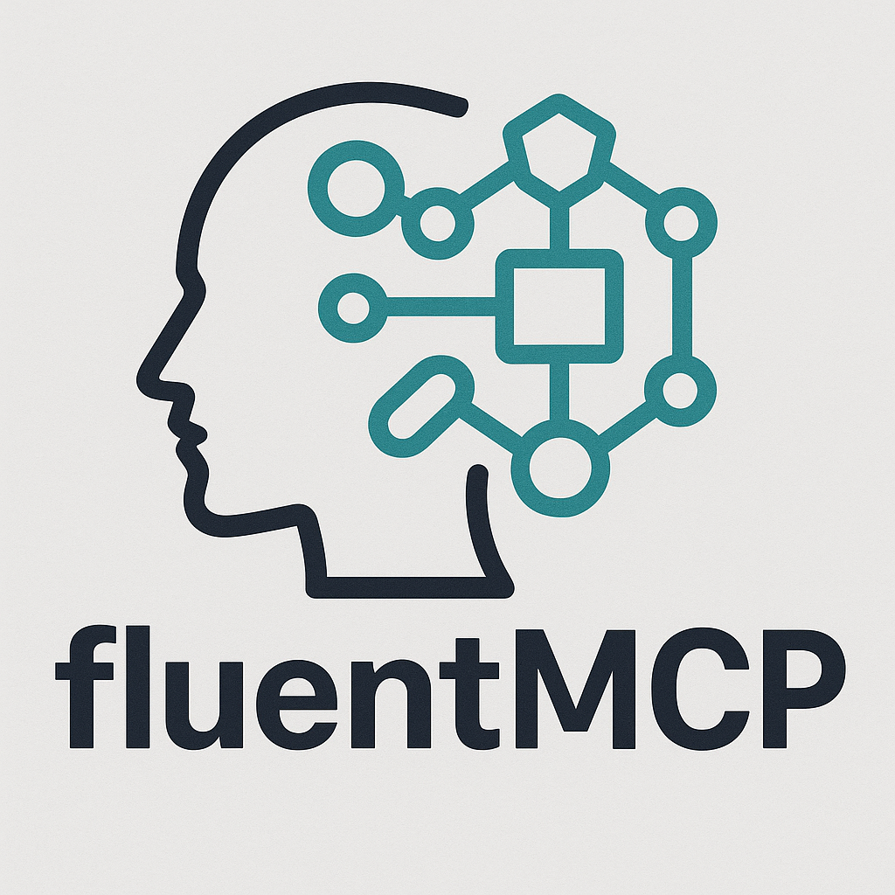

# Fluent MCP



A chainable, fluent interface for building Model Context Protocol (MCP) servers with minimal code. This library provides a jQuery-like API for creating MCP servers with built-in CRUD operations and resource management.

## Features

- **Chainable API**: Create and configure MCP servers with a fluent, chainable interface
- **Built-in CRUD Operations**: Automatically generate CRUD tools for your resources
- **Resource Management**: Easily manage resources with built-in storage
- **Flexible Configuration**: Simple by default, but customizable when needed
- **TypeScript Support**: Full TypeScript declarations for type safety
- **JavaScript Compatibility**: Works in both TypeScript and JavaScript environments

## Installation

```bash
npm install @jasonkneen/fluent-mcp
```

## Quick Start

```bash
# Run the demo server
npm start
```

## Using the Fluent MCP Interface

### Simple Usage

There are multiple ways to use Zod with FluentMCP for schema validation:

#### Option 1: Import Zod separately (traditional approach)

```javascript
import { createMCP, z } from '@jasonkneen/fluent-mcp';

// Create a new MCP server with fluent interface
const server = createMCP('Notes API', '1.0.0')
  // Define the Notes resource and CRUD operations
  .resource('Notes', {})
  .crud('Note', {
    title: z.string().describe('The title of the note'),
    content: z.string().describe('The content of the note'),
    tags: z.array(z.string()).optional().describe('Optional tags for the note')
  })
```

#### Option 2: Use the built-in `.z` property

```javascript
import { createMCP } from '@jasonkneen/fluent-mcp';

// Create a new MCP server with fluent interface
const server = createMCP('Notes API', '1.0.0');

// Use the built-in .z property for schema validation
server
  .resource('Notes', {})
  .crud('Note', {
    title: server.z.string().describe('The title of the note'),
    content: server.z.string().describe('The content of the note'),
    tags: server.z.array(server.z.string()).optional().describe('Optional tags for the note')
  })
```

#### Option 3: Use the built-in `.schema` property (alternative name)

```javascript
import { createMCP } from '@jasonkneen/fluent-mcp';

// Create a new MCP server with fluent interface
const server = createMCP('Notes API', '1.0.0');

// Use the built-in .schema property for schema validation
server
  .resource('Notes', {})
  .crud('Note', {
    title: server.schema.string().describe('The title of the note'),
    content: server.schema.string().describe('The content of the note'),
    tags: server.schema.array(server.schema.string()).optional().describe('Optional tags for the note')
  })
```

#### Option 4: Destructure for cleaner code

```javascript
import { createMCP } from '@jasonkneen/fluent-mcp';

// Create a new MCP server with fluent interface
const server = createMCP('Notes API', '1.0.0');
const { z } = server;  // or const { schema } = server;

server
  .resource('Notes', {})
  .crud('Note', {
    title: z.string().describe('The title of the note'),
    content: z.string().describe('The content of the note'),
    tags: z.array(z.string()).optional().describe('Optional tags for the note')
  })
  
  // Add a custom search tool
  .tool(
    'searchNotes',
    {
      query: z.string().describe('The search query')
    },
    async ({ query }) => {
      // Implementation...
    }
  )
  
  // Enable stdio transport and start the server
  .stdio()
  .start();
```

### Advanced Usage

```javascript
import { createAdvancedMCP, z } from '@jasonkneen/fluent-mcp';

// Create a new MCP server with advanced options
const server = createAdvancedMCP('Task Manager API', '1.0.0', {
  autoGenerateIds: false,  // We'll manage IDs ourselves
  timestampEntries: true   // But keep automatic timestamps
})
  // Define resources with custom options
  .resource('Tasks', {})
  .crud('Task', {
    id: z.string().describe('The unique ID of the task'),
    title: z.string().describe('The title of the task'),
    // ...more fields
  }, {
    singularName: 'Task',
    pluralName: 'Tasks'  // Explicit pluralization
  })
  
  // Start the server
  .start();
```

## Running the Demos

### JavaScript Demo (Default)

```bash
npm start
# or
npm run demo
```

### TypeScript Example Server

```bash
npm run demo:ts
```

## Available Methods

### Core Methods

- `createMCP(name, version, options)`: Create a new FluentMCP instance with simple defaults
- `createAdvancedMCP(name, version, options)`: Create a new FluentMCP instance with advanced options
- `z`: Re-exported Zod library for schema definitions (no need to install Zod separately)

### Server Methods

- `resource(name, initialData)`: Initialize a resource store
- `getResource(name)`: Get a resource store
- `setResource(name, id, data)`: Set a resource value
- `deleteResource(name, id)`: Delete a resource value
- `crud(resourceName, schema, options)`: Create CRUD operations for a resource
- `tool(name, schema, handler)`: Add a tool to the server
- `stdio()`: Enable stdio transport
- `start()`: Start the server with the configured transport

## Testing

Run the tests with:

```bash
npm test
```

Or watch mode:

```bash
npm run test:watch
```

## Customizing

You can extend the FluentMCP class with your own methods to add additional functionality. The chainable design makes it easy to add new capabilities while maintaining a clean API.